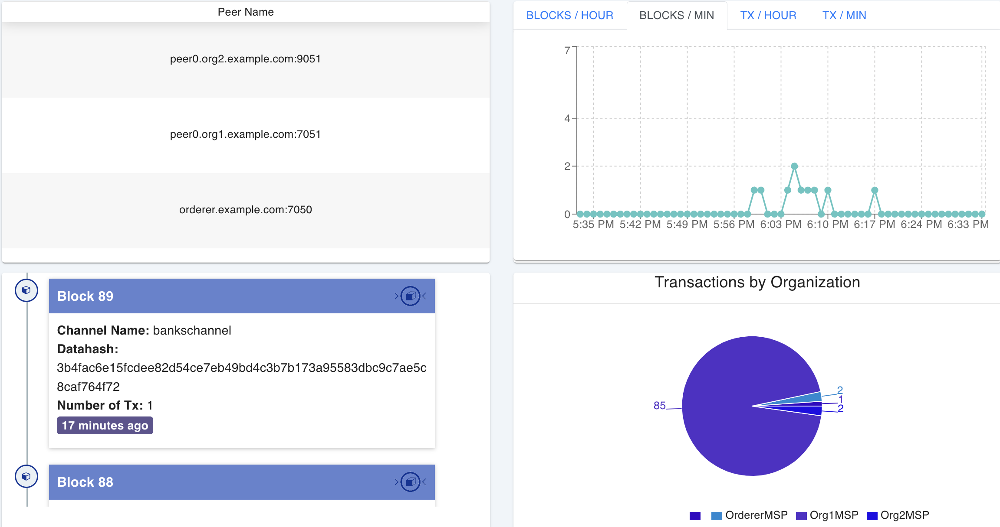

# Blockchain Based Cross Border Payment System

Cross Border Payment is a private blockchain application based on Hyperledger. This project aims to facilitate the tracking and processing of cross-border payments.

## Project Description

This project is a blockchain application developed on the Hyperledger framework. It includes smart contracts used for tracking, validating, and processing cross-border payments. A network has been established for transactions between different banks, ensuring transparent monitoring of payment processes.

## Installation

To run this project in a local development environment, you can follow the steps below:

Requirements:
   - Docker
   - Nodejs 

### Terminal Commands

### Starting the Network and Running the Application

1. Navigate to the `cbps-network` directory:

```bash
cd cbps-network
```

2. Run the following command to start the network and create a channel:

```bash
./network.sh up createChannel -c bankschannel -ca -s couchdb0
```

3. Deploy the chaincode by running the following command:

```bash
./network.sh deployCC -c bankschannel -ccn bank -ccp ../crossBorderPayment/chaincode-go/ -ccl go -ccep "OR('Org1MSP.peer','Org2MSP.peer')"
```

4. Navigate to the `crossBorderPayment/application` directory:

```bash
cd ../crossBorderPayment/application
```

5. Install the required dependencies using npm:

```bash
npm install
```

6. Run the following commands to enroll the admin users:

```bash
node enrollAdmin.js org1
node enrollAdmin.js org2
```

7. Start the application by running the following command:

```bash
node app.js
```
If there are no errors, the explorer interface will be accessible at `http://localhost:3000`.


### Explorer Configuration

1. Modify the necessary files for the explorer:

   - Take the name of the file in the `cbps-network/organizations/peerOrganizations/org1.example.com/users/Admin@org1.example.com/msp/keystore` directory.
   - Change the end of the `adminPrivateKey` value in the `explorer/cbps-network.json` file.

2. Navigate to the `explorer` directory:

```bash
cd explorer
```

3. Run the following command to start the Docker containers:

```bash
docker-compose up
```




4. If there are no errors, the explorer interface will be accessible at `http://localhost:8080`.

### Stop and Clear Network

1. Navigate to the `cbps-network` directory:

```bash
cd cbps-network
```

2. Run the following command to shut down the network:

```bash
./network.sh down
```

3. Navigate to the `crossBorderPayment/application` directory:

```bash
cd ../crossBorderPayment/application
```

4. Delete the `wallet` and `node-modules` directories:

```bash
rm -rf wallet
rm -rf node-modules
```
```
Stopping and Removing Docker Containers:

```bash
docker stop $(docker ps -a -q)
docker rm -f $(docker ps -aq)
docker system prune -a
docker volume prune
```

Listing Docker Containers and Images:

```bash
docker ps -a
docker images -a
docker volume ls
```
